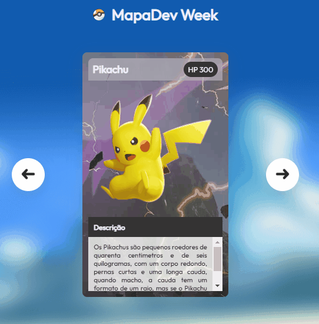

# Projeto Pokemon Slider DevQuest 

O projeto foi criado pelos gêmeos da DevQuest Beto e Cadu, no qual ensinaram em fazer cards utilizando imagens de Pokemons e através deles fazer um Carousel em JavaScript usando as tecnologias de HTML, CSS e JavaScript.

## Tecnologias utilizadas 

- HTML
- CSS
- JavaScript 
